# ExpenseWise 💸 - Moliyaviy Nazorat Platformasi

ExpenseWise — bu shaxsiy xarajatlarni kuzatib borish, moliyaviy maqsadlarni belgilash va oylik hisobotlarni tahlil qilish uchun mo'ljallangan zamonaviy web-ilova.

## 📸 Skrinshotlar

  
<b>Asosiy sahifa (Landing Page)</b>

  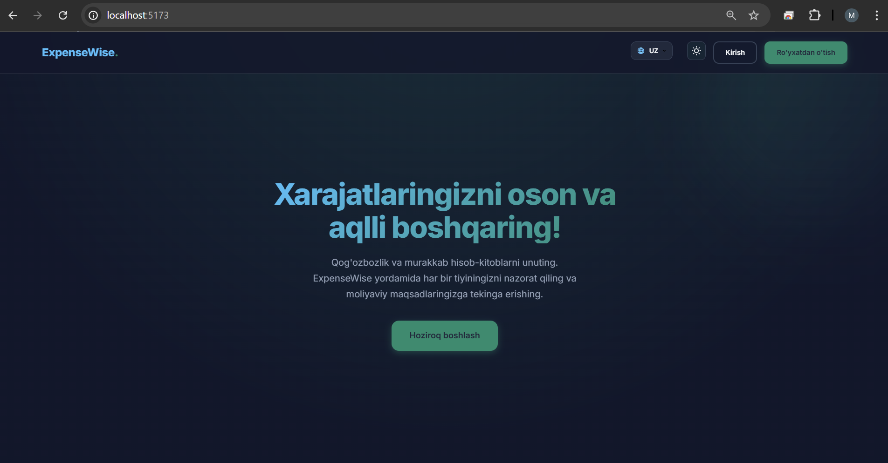
    
  
<b>Ro'yxatdan o'tish</b>

  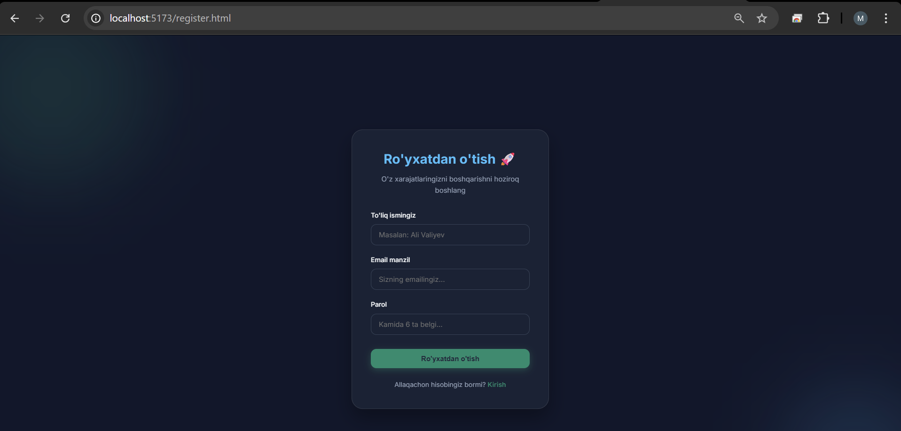
    
  
<b>Tizimga kirish</b>

  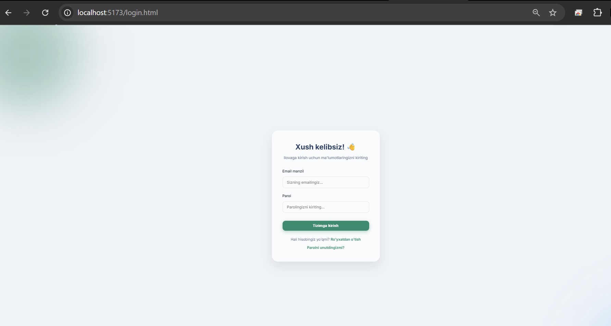
    
  
<b>Parolni unutdingizmi?</b>

  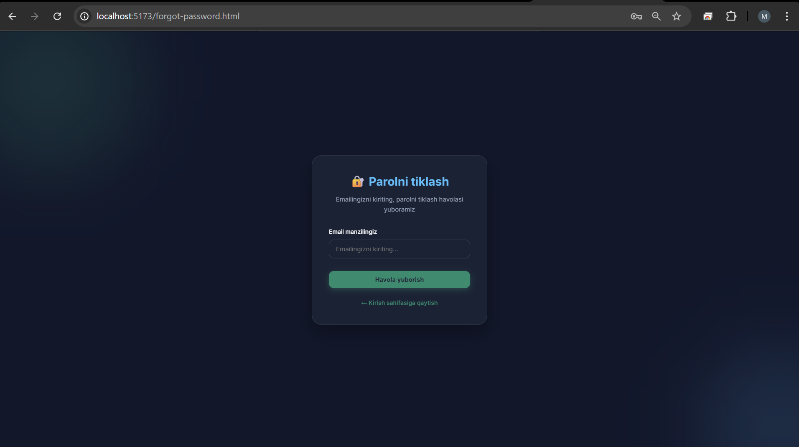
    
  
<b>Parolni tiklash</b>

  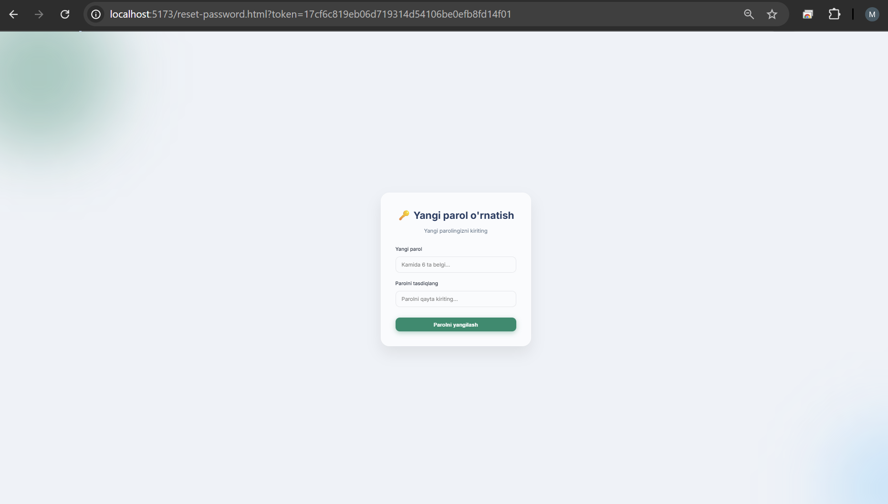
    
  
<b>Dashboard</b>

  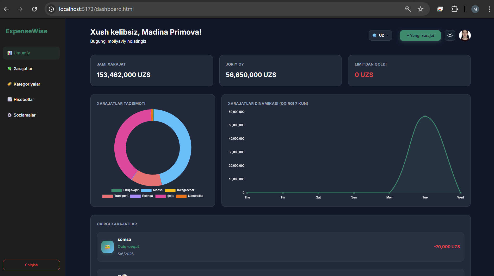
    
  
<b>Xarajat qo'shish</b>

  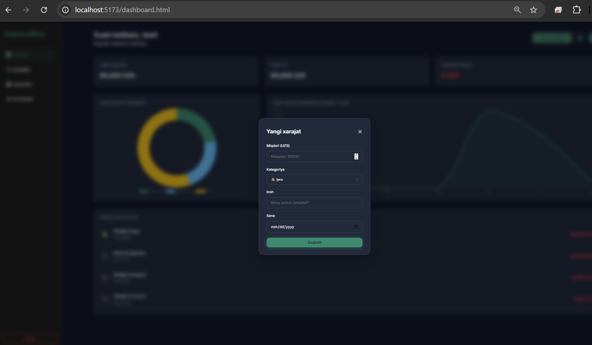
    
  
<b>Xarajatlar ro'yxati</b>

  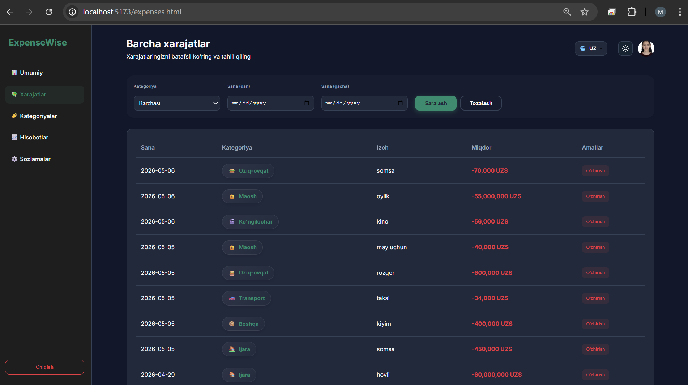
    
  
<b>Kategoriyalar</b>

  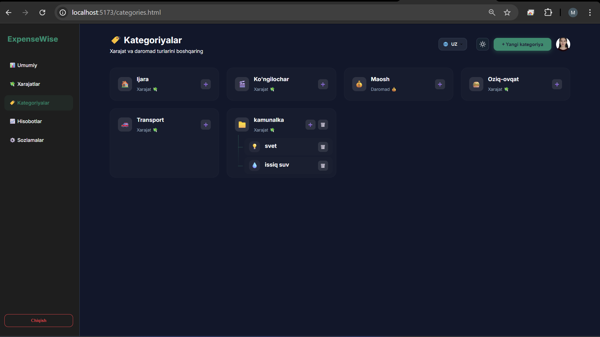
    
  
<b>Yangi kategoriya qo'shish</b>

  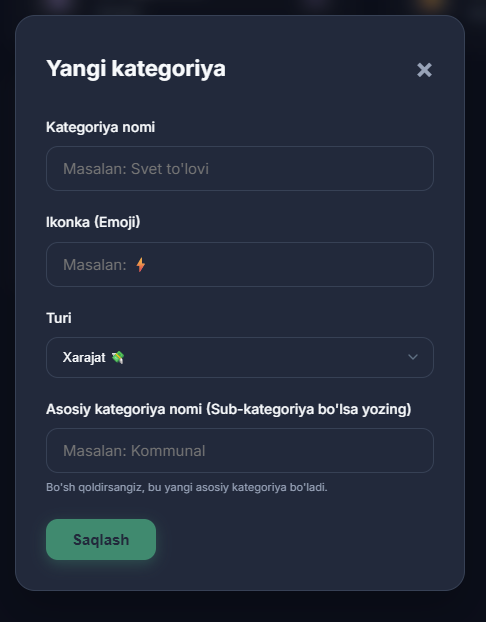
    
  
<b>Hisobotlar</b>

  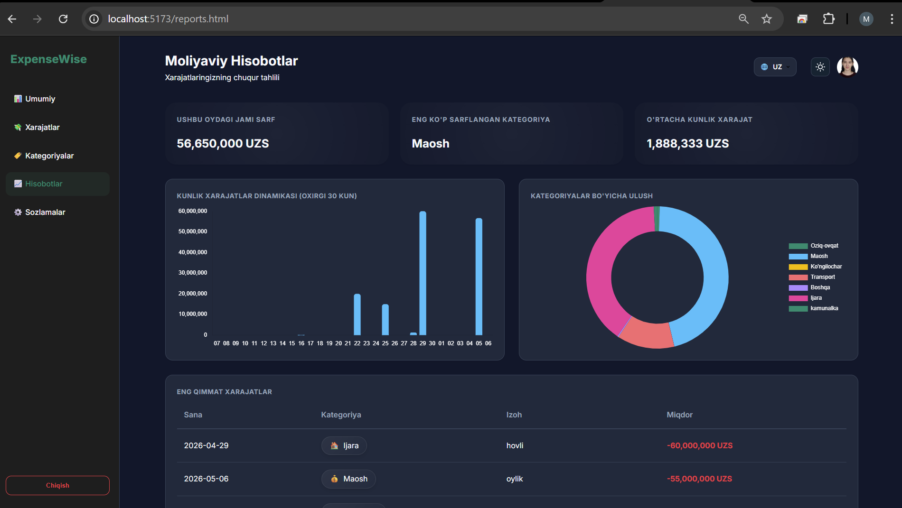
    
  
<b>Hisobotlar tahlili</b>

  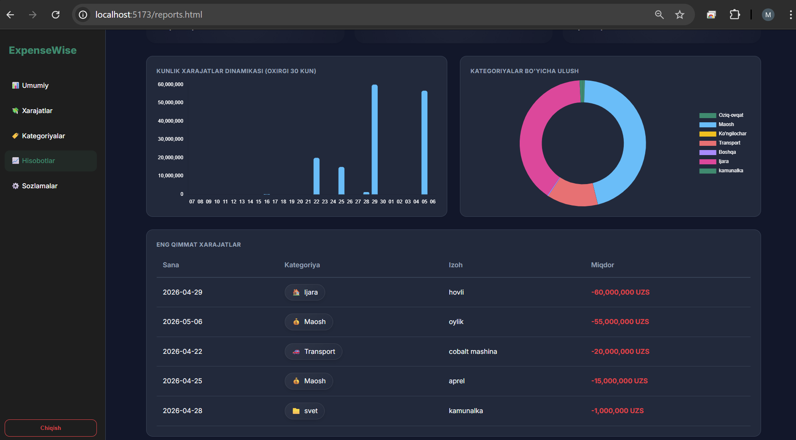
    
  
<b>Sozlamalar</b>

  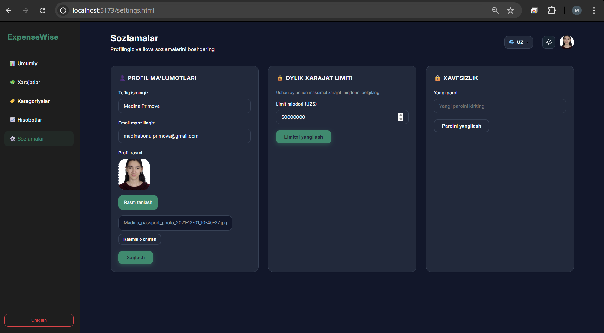

## ✨ Imkoniyatlar

- 🌍 **Multi-language (Ko'p tillilik)**: Ilova to'liq 3 ta tilda (**O'zbek, Rus, Ingliz**) ishlaydi. Sahifa yangilanmasdan turib tilni darhol o'zgartirish imkoniyati (Reactive i18n).
- 🔐 **To'liq Autentifikatsiya**: Ro'yxatdan o'tish, tizimga kirish va parolni email orqali tiklash.
- 📊 **Interaktiv Dashboard**: Xarajatlar statistikasi, haftalik dinamika va oylik limit nazorati.
- 💸 **Xarajatlar Boshqaruvi**: Xarajatlarni qo'shish, o'chirish va kategoriyalar bo'yicha filtrlash.
- 📉 **Kategoriyalar**: Dinamik kategoriya va sub-kategoriyalar yaratish, ikonkalarni boshqarish.
- 📈 **Chuqur Analitika**: Eng ko'p sarf qilinayotgan kategoriyalar va kunlik o'sish grafiklari.
- ⚙️ **Shaxsiy Sozlamalar**: Profil ma'lumotlarini tahrirlash, parolni o'zgartirish, **Profil rasmini yuklash** va oylik budjet limitini o'rnatish.
- 🌗 **Dark Mode**: Ko'zga qulay qorong'u va yorug' rejimlar.
- 📱 **Responsive Design**: Mobil qurilmalar, planshet va kompyuterlar uchun to'liq moslashgan interfeys.

## 🛠 Texnologiyalar

**Frontend:**
- HTML5 & Vanilla CSS3 (Glassmorphism design)
- JavaScript (ES6+) - **Module-based architecture**
- [Chart.js](https://www.chartjs.org/) - Grafika va diagrammalar uchun
- [Vite](https://vitejs.dev/) - Tezkor loyiha yig'uvchi

**Backend:**
- [Node.js](https://nodejs.org/) & [Express.js](https://expressjs.com/)
- [MongoDB](https://www.mongodb.com/) & [Mongoose](https://mongoosejs.com/)
- [JWT](https://jwt.io/) - Xavfsiz autentifikatsiya
- [Nodemailer](https://nodemailer.com/) - Email tizimi

## 🚀 O'rnatish va Ishga tushirish

1. **Loyihani klonlash:** `git clone https://github.com/madinkapr/expensesTracker.git`
2. **Bog'liqliklarni o'rnatish:** `pnpm install`
3. **Muhit o'zgaruvchilari:** `apps/api/.env` faylini yarating va to'ldiring.
4. **Ishga tushirish:** `pnpm dev`

---
Yaratuvchi: **Madinabonu Primova** 🦾
